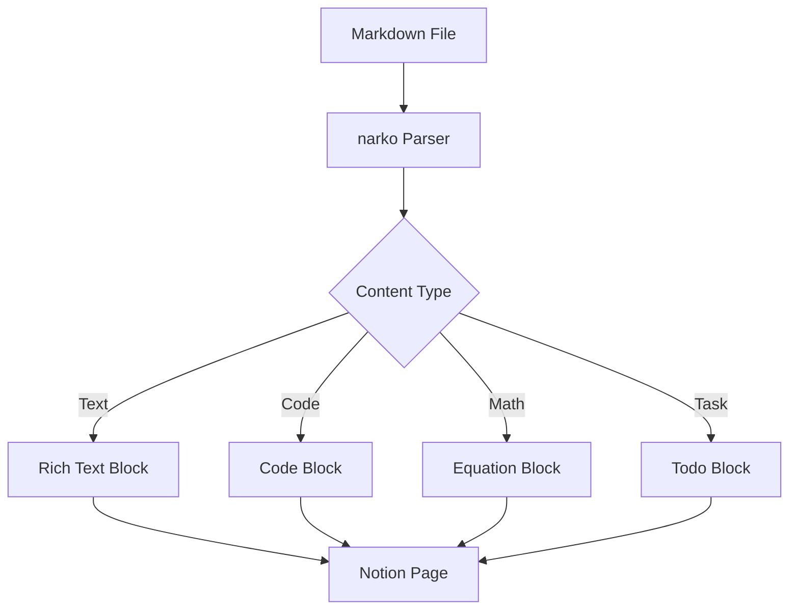
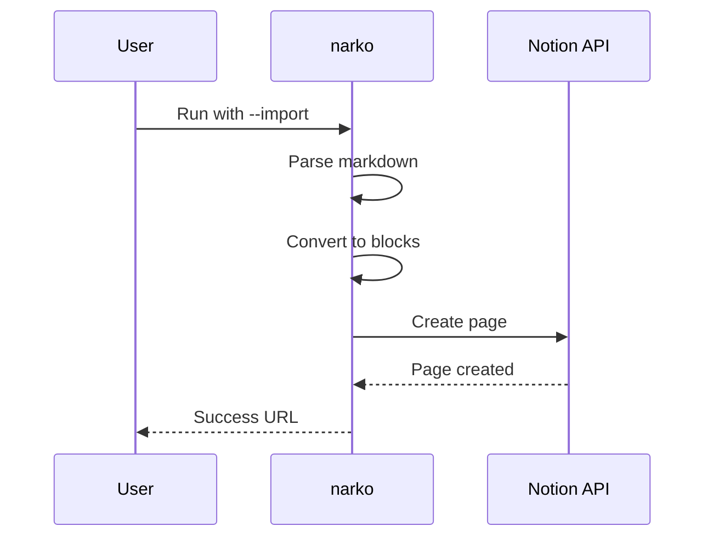

# Common Features Test

Quick test of frequently used markdown features in narko.

## Text Formatting
**Bold text**, *italic text*, and `inline code`.

## Task Lists
- [x] Completed task
- [ ] Todo task

## Code Block
```python
def example():
    return "Hello World"
```

## Math
Inline math: $x = \frac{-b \pm \sqrt{b^2-4ac}}{2a}$

Block math:
$$
\int_0^\infty e^{-x^2} dx = \frac{\sqrt{\pi}}{2}
$$

## Callout
> [!NOTE]
> This is an important note with **bold** and *italic* text.

## Highlight
This text has ==highlighted portions== for emphasis.

## Quote
> This is a regular blockquote for attributed text.

## Table
| Feature | Status | Notes |
|---------|--------|-------|
| Headers | ✅ Working | All levels supported |
| Math | ✅ Working | Both inline and block |
| Tables | ❓ Testing | May fall back to text |

## Complex Mixed Lists
1. First numbered item
   - Nested bullet under number
     - [ ] Task nested under bullet
     - [x] Completed task nested under bullet
   - Another nested bullet with **bold text**
     1. Numbered item nested under bullet
     2. Another numbered nested item
2. Second numbered item
   - [x] Task directly under numbered item
     - Bullet nested under task
       - [ ] Task nested under bullet under task
   - [ ] Uncompleted task under numbered item
     1. Numbered item under task
        - Final bullet at deep level


## Images


*Note: Image embedding depends on file upload capabilities*

## Mermaid Diagrams




## Link
Check out [narko on GitHub](https://github.com/user/narko) for more info.

