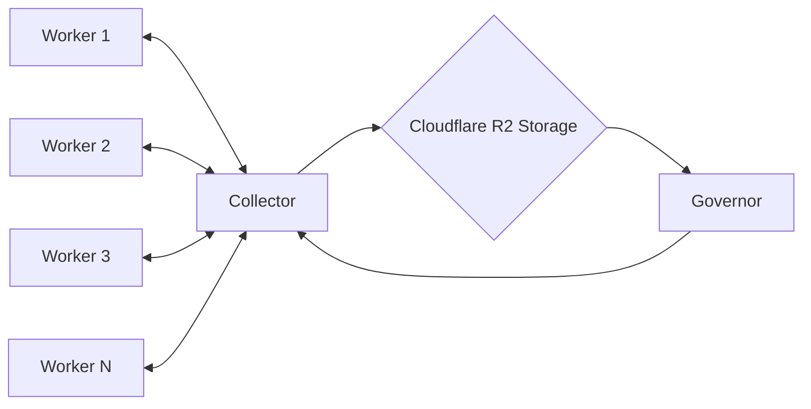
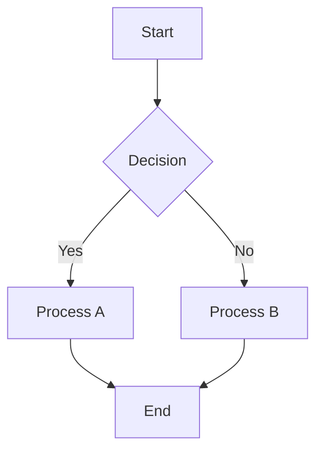
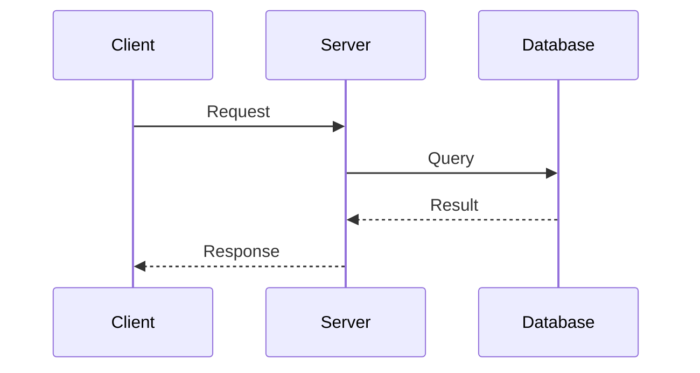

# Advanced Notion Features Test

This file tests advanced Notion-specific features that may not be fully supported yet but are worth testing for future development.

---

## 1. Mermaid Diagrams







---

## 2. Multiple Columns Layout

> [!NOTE]
> Columns in Notion:
> - Left column content
> - Middle column content  
> - Right column content

This would ideally become a multi-column layout in Notion, but currently will likely render as a regular callout.

---

## 3. Complex Math Expressions

### Advanced LaTeX

$$
B = \exp\left(\left(\frac{64}{9}\cdot \log(p)\right)^{\frac{1}{3}} \cdot \left(\log(\log(p))\right)^{\frac{2}{3}}\right)
$$

$$
\int_0^\infty e^{-x^2} dx = \frac{\sqrt{\pi}}{2}
$$

$$
\sum_{n=1}^{\infty} \frac{1}{n^2} = \frac{\pi^2}{6}
$$

### Inline Complex Math
The smoothness bound $B = \exp\left(\left(\frac{64}{9}\cdot \log(p)\right)^{\frac{1}{3}} \cdot \left(\log(\log(p))\right)^{\frac{2}{3}}\right)$ is used in factorization.

---

## 4. Advanced Code Features

### Shell/Bash Code
```shell
# Prime modulus
p = 3217014639198601771090467299986349868436393574029172456674199

# Generator
g = 5

# Precomputed powers of the generator (5) modulo p
5^a = 244241057144443665472449725715508406620552440771362355600491
5^b = 794175985233932171488379184551301257494458499937502344155004
```

### Multi-language Code Examples
```python
# Python factorization example
def factor_relation(g, k, h, factor_base):
    """Factor g^(2k) - h^2 using the factor base"""
    value = pow(g, 2*k) - h*h
    factors = []
    for prime in factor_base:
        while value % prime == 0:
            factors.append(prime)
            value //= prime
    return factors if value == 1 else None
```

```javascript
// JavaScript implementation
function generateRelation(g, p) {
    const k = Math.floor(Math.random() * 1000000);
    const h = Math.floor(Math.random() * 1000000);
    return {
        left: (Math.pow(g, k) + h) % p,
        right: (Math.pow(g, k) - h) % p
    };
}
```

---

## 5. File and Media References

### Images (will likely not work without upload support)


### File References
[Download PDF Resume](./resume.pdf)

### Embedded Content References
![[embedded-document.md]]

---

## 6. Database-like Tables (Advanced)

| Task | Status | Priority | Assignee | Due Date |
|------|--------|----------|----------|----------|
| Implement Worker | 🍿 In Progress | High | Alice | 2024-01-15 |
| Setup Collector | 🧐 To Review | Medium | Bob | 2024-01-20 |
| Deploy Governor | 📅 Scheduled | Low | Charlie | 2024-01-25 |
| Testing | ✅ Complete | High | Diana | 2024-01-10 |

---

## 7. Advanced Text Features

### Mixed Formatting Combinations
This paragraph has **bold text**, *italic text*, `inline code`, ==highlighted text==, and even $inline\ math$ all in one place with [links](https://example.com) too.

### Special Characters and Unicode
Mathematical symbols: ∑ ∫ √ π ∞ ≈ ≠ ≤ ≥ ∈ ∀ ∃ ∅
Greek letters: α β γ δ ε ζ η θ ι κ λ μ ν ξ ο π ρ σ τ υ φ χ ψ ω
Arrows: → ← ↑ ↓ ↔ ⇒ ⇐ ⇔
Currency: $ € £ ¥ ₹ ₿

---

## 8. Complex Callout Combinations

> [!WARNING]
> This callout contains:
> 
> **Formatted text** and *emphasis*
> 
> ```python
> code_blocks = True
> ```
> 
> - Task lists:
>   - [x] Completed task
>   - [ ] Pending task
> 
> And even $math: x^2 + y^2 = z^2$

---

## 9. Nested Structure Testing

### Deep Nesting Example
- Level 1 item
  - Level 2 item with **bold**
    - Level 3 item with `code`
      - Level 4 item with ==highlight==
        - Level 5 item with $math$

1. Ordered list level 1
   1. Ordered list level 2
      1. Ordered list level 3
         1. Ordered list level 4

---

## 10. Error Conditions and Edge Cases

### Empty Elements
- [ ] 
- [x] 

```

```

$$
$$

### Malformed Syntax
==unclosed highlight

$unclosed math

> [!INVALID_CALLOUT_TYPE]
> This should fall back to regular quote

---

## Summary

This advanced test file covers:
- ✅ Mermaid diagrams (likely to render as code blocks)
- ✅ Multi-column layout concepts (will render as callouts)
- ✅ Complex mathematical expressions 
- ✅ Advanced code examples with multiple languages
- ✅ File/media references (will likely need upload support)
- ✅ Database-style tables with status emojis
- ✅ Complex text formatting combinations
- ✅ Unicode and special characters
- ✅ Complex nested callouts with mixed content
- ✅ Deep nesting scenarios
- ✅ Error conditions and malformed syntax

Expected current behavior:
- Mermaid → Code blocks
- Columns → Regular callout
- Complex math → Equation blocks or code
- Tables → May fall back to paragraphs
- File references → Links (without actual upload)
- Most other features should work as expected